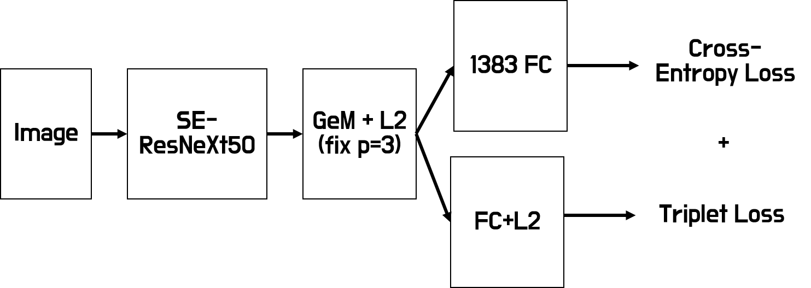
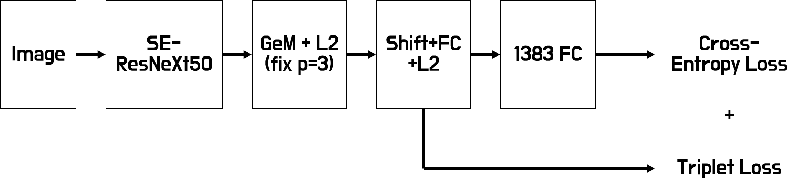
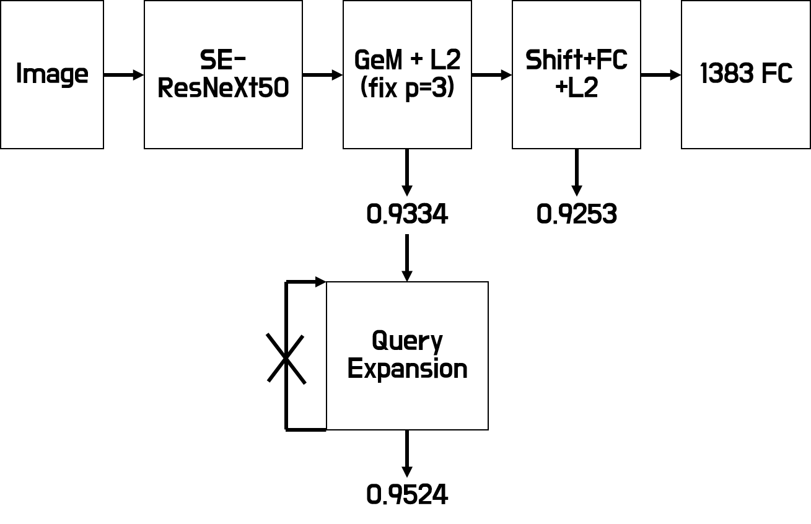

# 네이버 AI 해커톤 2018_Ai Vision

비록 8등이지만 제가 했던 내용들을 최대한 공유하고자 작성하였습니다.

## 예선 1차

예선 1차는 keras MobileNetV2를 pretrained weight를 불러와서 cross-entropy loss 
학습을 통해서 0.5정도의 점수를 달성한 것으로 기억합니다. 예선 1차에서 
scikit-learn의 stratified k fold를 사용했고 validation set에 따라 점수 변동 폭이 컸었습니다.
여러번 테스트 후 가장 좋았던 random seed로 validation set을 만들고 학습해서 제출했습니다.

## 예선 2차 & 결선

예선 2차에서 같은 방법으로는 0.2정도의 점수를 얻는 것을 보고 바로 triplet으로 넘어갔습니다.
triplet의 많은 부분들은 kaggle Google Landmark Retrieval Challenge의 17등
[toshi_k](https://github.com/toshi-k/kaggle-google-landmark-retrieval-challenge)
의 코드를 참고했습니다. Resnet50과 코드 그대로 batch 내에서 hard positive와 hard negative를 이용해서
 학습했을 때 0.77정도 점수를 냈습니다.
 
Resnet50보다 망이 더 깊다면 좋은 성능을 보일것이라고 판단했습니다.
[pytorch_pretrained_model](https://github.com/Cadene/pretrained-models.pytorch)에서 imagenet에서
높은 accuracy를 보이고 적당한 모델용량을 가진 SE-ResNeXt50을 선택했습니다. 

Resnet50과 triplet으로 학습할 때 매우 느렸는데, 이를 줄이고자 SE-ResNeXt50에서 마지막
fc layer의 출력이 1383이 되도록 바꾸고 cross-entropy로 학습을 한뒤 모델을 저장했습니다.
triplet을 학습할 때 cross-entropy로 학습된 모델을 불러와 학습을 하니 학습시간이 많이 단축되었습니다.
이 때 결과는 0.85정도 꾸준히 나왔습니다.

baseline 코드의 cos similarity가 아닌 
[Approximate_nearest_neighbor](https://github.com/spotify/annoy)를 사용하니 점수가 조금 더 상승했습니다.

이 아래는 여러 시도를 해봤던 내용들입니다.

1. Resnet50을 triplet으로 학습한 뒤 PCA를 사용했을 때는 점수가 조금 올랐지만 SE-ResNeXt50에
PCA를 사용했을 때는 점수가 오히려 떨어져서 사용하지 않았습니다.

2. 1383 FC layer를 붙여서 loss에 cross-entropy를 추가해서 학습한 결과 학습이 더 빨라지고
결과도 더 좋아졌습니다. FC layer를 붙이는 방법에 대해서는 2가지를 시도했습니다. 각 모델의 모양은 다음과 같습니다.
둘 중 양갈래로 퍼지는 것이 아닌 일렬로 쌓는 방식이 좀 더 좋은 결과를 보여줬습니다.

3. embedding vector로 만드는 FC layer의 경우 다양한 크기로 테스트 했는데 크기가 2048일 때가
가장 좋았습니다. 저는 음수인 부분도 사용해야 더 좋을것같아 ReLU를 사용하지 않았는데 멘토링
결과 Non linear한 activation이 없다면 FC layer가 의미가 없다고 듣고 뒤늦게 깨달았습니다.
시간이 없어서 ReLU를 추가해서 학습해 보지는 못했습니다.

4. 3과 연관된 문제라고 생각되는데 결과론 적으로 FC를 통과한 후 제출한 것보다 pooling 이후를
제출한 것이 점수가 더 높았습니다. 멘토님께 물어본 결과 FC layer가 PCA whitening 역할이기 때문에
pooling 후 점수가 FC layer를 통과한 것보다 좋을 수도 있고 이건 직접 해봐야 아는 것이라고 답변을 들었습니다.

5. DBA가 결국은 query를 query와 reference 전체에서 가장 가까운(cos similarity나 euclidean) 특정
개수의 vector를 평균내어 바꿔주는 것으로 알고있습니다. 저는 반복은 하지 않고 가장 가까운 3개의 백터와
자기 자신을 평균 내었을 때 가장 많이 점수가 올랐습니다. 맨처음 저의 코드가 잘못되어 점수가 떨어졌는데
그걸 모르고 DBA 이후 점수가 떨어진다고 멘토링을 받았더니 멘토님께서 query는 query내에서 가장 가까운 것을 찾아 평균을 취하고
reference는 reference끼리 해보라고 하셔서 그렇게 했더니 가장 점수가 크게 올랐습니다. weighted average도
시도했는데 크게 점수가 오르지는 않았습니다.

스스로 아쉬웠던 점

1. 크기가 작은 망들을 가지고 앙상블을 시도하지 않았던 점

2. 위에서 언급한 비선형 activation을 고려하지 못한 점

## 결과

